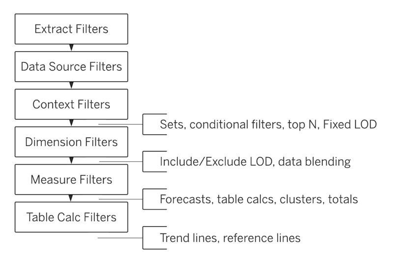

<h1><strong>Week-9 (23-29 August 2021)</strong>

 

<h1><strong>Meeting Agenda</strong></h1>

▶ Icebreaking 

▶ Micro Learning & Presentations 

▶ Project Discussion

 
 
 

<h1><strong>Teamwork Schedule</strong></h1>

<table style= "width:100%;">
                <tr>
                <td style="color: #FA8072; text-align:left "><h3><strong>
Ice-breaking</td>
                <td style="color: #FA8072; text-align:right;"><h3><strong>
10m
<td>                </tr>
</table>

- Personal Questions 
- Any challenges (Classes, Coding, studying, etc.) 
- How you’re studying, you need personal advice? 
- Remember that practice makes perfect. 
- What exactly each student does for the team, if they know each other, if they care for each other, if they follow and talk with each other etc. 

 
 

<table style= "width:100%;">
                <tr>
                <td style="color: #FA8072; text-align:left "><h3><strong>
Micro Learning & Presentations</td>
                <td style="color: #FA8072; text-align:right;"><h3><strong>
30m
<td>                </tr>
</table>
(The problems and subjects in this part, has been prepared especially for you to equip yourself for the interview process and improve your coding skills.
To get the most from this part, it’s highly recommended to be prepared and present the topics in English.
At first, it can be difficult to present in English and you can read from your notes, no problem.
We strongly advise you to force yourself to present especially the interview questions in English.
However, if you don’t feel you can present in English, you can do any part in Turkish, that’s no problem too.
Please remember; we don’t want to put extra pressure to anyone, it’s totally up to you how you prepare for this section.
The main and only aim of this part is to develop your skills that you need during and after the recruitment process and make you ready for the DS career.)
  

<h3 style="color: #FA8072; text-align:left "><strong>Questions & Problems Related to Course Topics</strong></h4>

Use the Sample - Superstore.xlsx data set to answer the questions below:

**1. What are the top 10 products in Appliances sub-category?**

**2. Order of Operations in Tableau (read and discuss with the team)**

The order of operations in Tableau, sometimes called the query pipeline, is the order in which Tableau performs various actions. Actions are also known as operations. Many operations apply filters, which means that as you build a view and add filters, those filters always execute in the order established by the order of operations.

Sometimes, you might expect Tableau to execute filters in one order, but the order of operations dictates that they be executed in a different order, which gives you unexpected results. When this happens, you can sometimes change the order in which operations are executed in the pipeline.
The Tableau order of operations includes the following, from top to bottom.

 
**3. How to prepare an interactive resume (read and discuss with the team)**
    <b>
It is recommended that a team member prepare and submit a real or fake CV. 
</b>

 Go to the following link:

https://www.tableau.com/about/blog/2018/7/building-interactive-resume-tableau-90974

Then, read the article and review different types of interactive resumes created in Tableau in the article. 

Go to the following link:

https://public.tableau.com/en-us/s/interactive-resume-gallery
In this link, there are several interactive resumes created in Tableau. Pick up one example and review it. 
 

<h3 style="color: #FA8072; text-align:left " ><strong>Interview Questions</strong></h3>

**1. What kind of filters are used in Tableau?**

**2. What is Context Filter?**

 
 
<table style= "width:100%;">
                <tr>
                <td style="color: #FA8072; text-align:left "><h3><strong>
Project Discussion</td>
                <td style="color: #FA8072; text-align:right;"><h3><strong>
40m
<td>                </tr>
                
</table>

Discuss solution of assignment below : 
- [DBMD- E-University)](https://www.google.com/url?q=https://github.com/clarusway/Clarusway-DS-Students-08-21/tree/main/1-%2520Projects/03_C8_DS_DBMD_S1_(E-University)&sa=D&source=calendar&ust=1630055361933400&usg=AOvVaw3RfWmPn31DuGPFizs88AWG)  

